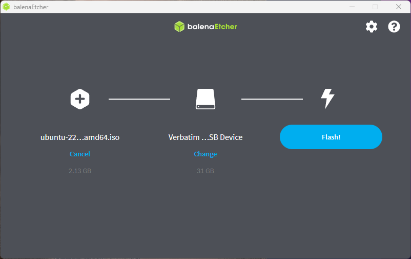
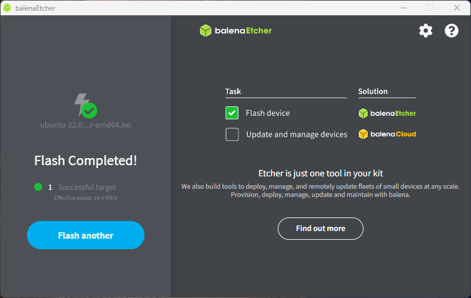
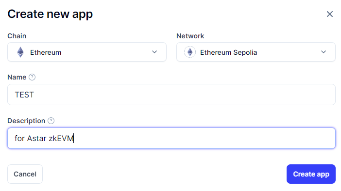

# Astar zkEVM Permissionless RPC Node Tutorial

## Overview

This tutorial provides detailed instructions on setting up a Permissionless RPC Node for Astar zkEVM.

This tutorial provides more detailed information based on the following documentation:
[Setup Astar zkEVM Permissionless RPC Node](https://docs.astar.network/docs/build/zkEVM/zk-node/setup-rpc-node/)

**Note:** As of the writing of this tutorial, Astar zkEVM has a deployed testnet, and it is assumed to be operational on the zKatana testnet for the purpose of this guide.

**Notes:** The intended audience for this tutorial includes engineers with at least basic knowledge of ICT and proficiency in Linux/Unix shell and fundamental operations.

## Prerequisites

Before setting up Astar zkEVM, several preparations are necessary. This tutorial focuses on running it on a physical PC with x86/64 (Intel, AMD) architecture.

Install a Linux OS (Ubuntu is used here) on this PC and install necessary components like docker and docker-compose to prepare the environment for running containers.

### System 

First, here are the recommended specifications for the PC:

* 16GB RAM
* 4-core CPU
* 100GB Storage (This will increase over time)

Also, the storage space requirements will increase as the network grows.
Ensure that the PC meets these specifications before proceeding with the Astar zkEVM setup.

### Install Ubuntu

The installation of Ubuntu can be referenced from the following documentation.

* https://ubuntu.com/tutorials/create-a-usb-stick-on-windows#1-overview


The general process involves creating a USB installation media for installation on the PC. Subsequently, the USB media is inserted into the PC, and the system is booted to initiate the OS installation. 

Here is a summary of the procedure:

1. Download balenaEtcher.
2. Download the Ubuntu ISO image.
3. Use balenaEtcher to set up the ISO image on a USB drive.


4. Insert the USB drive into the machine where the node will be set up and boot from it.
5. Perform the Ubuntu installation setup.

In this tutorial, we will not delve into the detailed setup of Ubuntu installation. There are no special procedures, and a minimal installation is sufficient.

### Install docker, docker-compose 

The Astar zkEVM RPC node is set to launch as a container. Therefore, preparation of the environment for container startup is necessary. Specifically, ensure that docker and docker-compose are in a usable state.

While docker-compose is part of docker's plugins and should not pose any issues, we will also set up the standalone version. Please refer to the following documentation:

* https://www.docker.com/get-started
* https://docs.docker.com/compose/install/

Below, we provide the setup logs for these, but please consider them as a reference. Make sure to consult the documentation thoroughly for proper preparation.

```bash
$ sudo apt-get update
$ sudo apt -y install build-essential
```
**Install docker**
```bash
$ sudo apt-get -y install ca-certificates curl gnupg
$ sudo install -m 0755 -d /etc/apt/keyrings
$ curl -fsSL https://download.docker.com/linux/ubuntu/gpg | sudo gpg --dearmor -o /etc/apt/keyrings/docker.gpg
$ sudo chmod a+r /etc/apt/keyrings/docker.gpg

$ sudo echo \
  "deb [arch="$(dpkg --print-architecture)" signed-by=/etc/apt/keyrings/docker.gpg] https://download.docker.com/linux/ubuntu \
  "$(. /etc/os-release && echo "$VERSION_CODENAME")" stable" | \
  tee /etc/apt/sources.list.d/docker.list > /dev/null

$ sudo apt-get update
$ sudo apt-get -y install docker-ce docker-ce-cli containerd.io docker-buildx-plugin docker-compose-plugin
```

**Install docker-compose**
```bash
$ DOCKER_CONFIG=${DOCKER_CONFIG:-$HOME/.docker}
$ mkdir -p $DOCKER_CONFIG/cli-plugins
$ curl -SL https://github.com/docker/compose/releases/download/v2.23.0/docker-compose-linux-x86_64 -o $DOCKER_CONFIG/cli-plugins/docker-compose
$ chmod +x $DOCKER_CONFIG/cli-plugins/docker-compose

$ echo "export PATH=$PATH:$DOCKER_CONFIG/cli-plugins/" > ~/.bashrc
$ . ~/.bashrc
$ docker-compose version
Docker Compose version v2.23.0
```

### Preparing Ethereum RPC node
To run the Astar zkEVM RPC node, an Ethereum RPC node is required. The documentation outlines the process using a public RPC endpoint ('https://eth-sepolia-public.unifra.io'), but in this case, there is a rate limit, which may lead to improper synchronization of the node. (Upon actual setup and reviewing the logs, frequent errors were observed.)

There are several methods to set up an RPC endpoint. In this tutorial, we will create a test endpoint using **[Alchemy](https://www.alchemy.com/)** and specify it for the Astar zkEVM RPC node. While we won't provide detailed instructions on the creation process, we will include a brief outline of the simple procedure.

1. Create an Alchemy account.
2. From the 'Apps' menu, select 'Create new app' and fill in the required details.

3. Confirm and record the 'API Key' and 'HTTPS' of the created app.


[!CAUTION] 
The information in the image is already invalid, and this is just a sample. 

## Setup zkEVM RPC Node

## Advanced

## Troublechute

## References


## Author Introduction

