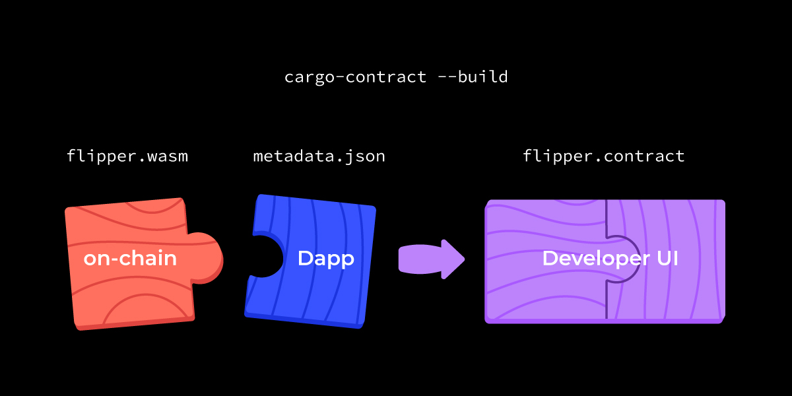
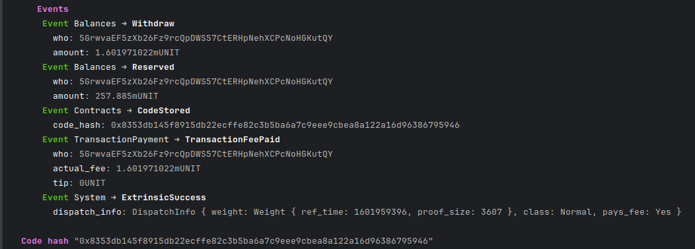
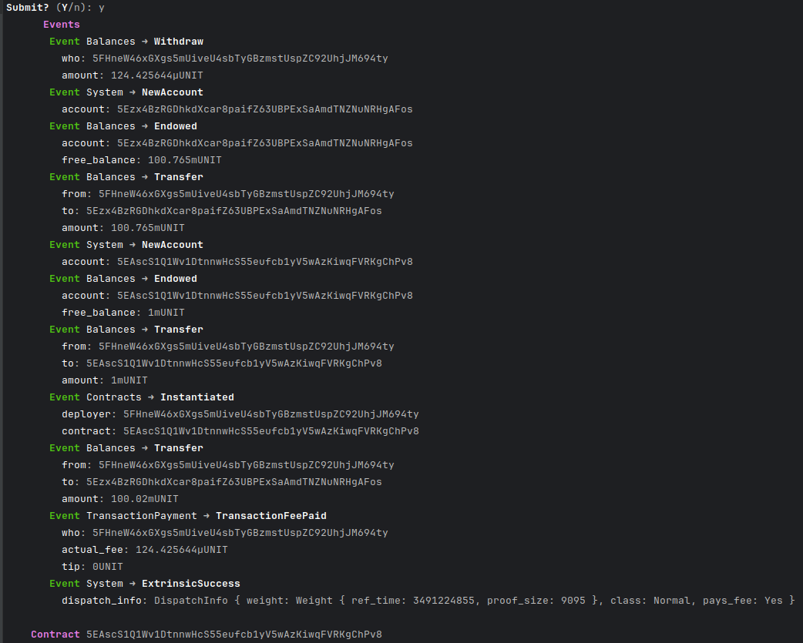
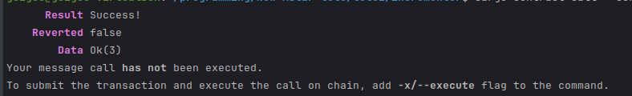
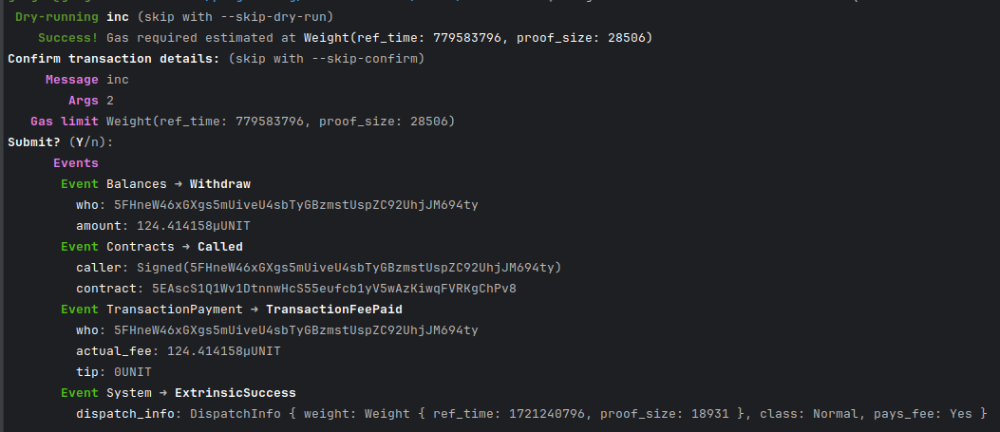
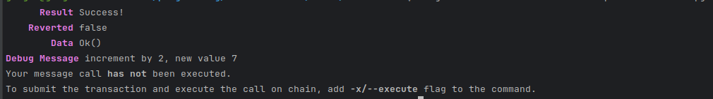
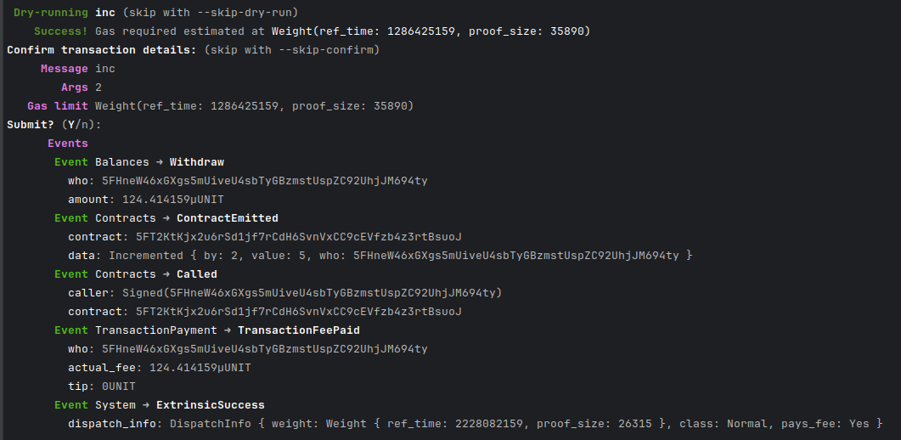
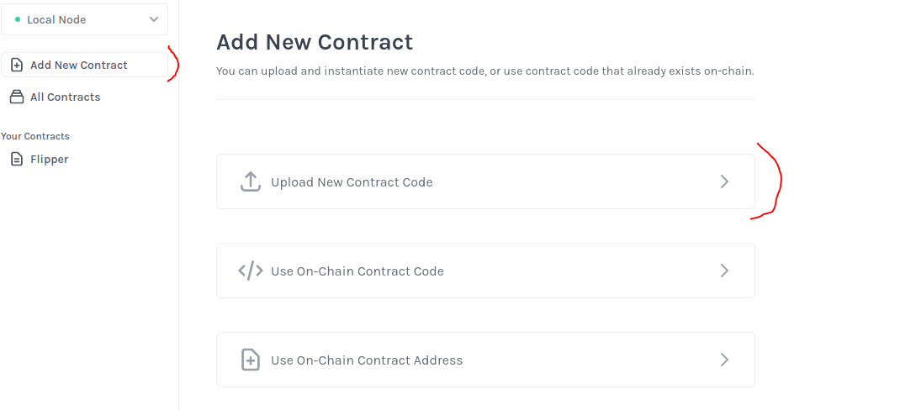
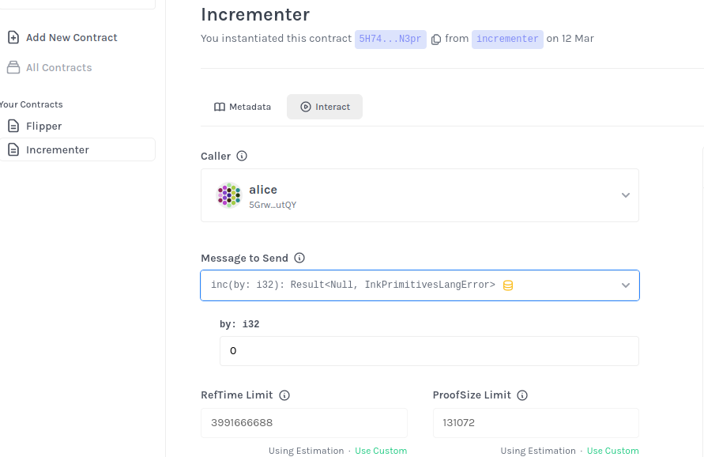

# An introduction to write Smart Contracts in Rust and Ink!

## Overview
This tutorial introduces :
 - how to write a first smart contract in Rust and Ink!,
 - the main macros used in Ink!,
 - how to build and deploy the smart contract on a Substrate Contracts Node, 
 - how to interact with the smart contract.

## Prerequisites

The version 1.72 (or higher) of Rust and the version 3.2.0 (or higher) of cargo-contract must be installed.  
To check the versions.
```bash
cargo --version
cargo-contract --version
```

A Substrate Node with the pallet Contracts must be installed to run `e2e tests` and deploy your contract in a local environment.  
To install the latest version: 
```bash
cargo install contracts-node --git https://github.com/paritytech/substrate-contracts-node.git
```

## Create a new project

Use the command `cargo contract new` to create a new rust project (in this tutorial the project name is incrementer)

```bash
cargo contract new incrementer
```

A new rust project is created with two files:
 - `Cargo.toml` : cargo manifest file
 - `lib.rs` : source code file

These files are generated based on the template flipper (our « hello world » template).

In the cargo manifest file we can see the dependency on the crate `ink!`
```
[dependencies]
ink = { version = "4.2.0", default-features = false }
```

In the source code file, `lib.rs`, we have different macros:
 - `#[ink :contract]`
 - `#[ink(storage)]`
 - `#[ink(constructor)]`
 - `#[ink(message)]`

### `#[ink :contract]` macro applicable to module

```rust
#[ink::contract]
mod incrementer {
...
}
```

Applied to the module, this macro is responsible for generating all the code necessary for interacting with the Contracts pallet

More information [here](https://use.ink/macros-attributes/contract).

### `#[ink(storage)]` macro applicable to struct
```rust
    #[ink(storage)]
    pub struct Incrementer {
        /// Stores a single `bool` value on the storage.
        value: bool,
    }
```

Applied on struct types in order to flag them for being the contract's storage definition. There can only be one ink! storage definition per contract.

More information [here](https://use.ink/macros-attributes/storage).

### `#[ink(constructor)]` macro applicable to methods.
```rust
    /// Constructor that initializes the `bool` value to the given `init_value`.
    #[ink(constructor)]
    pub fn new(init_value: bool) -> Self {
        Self { value: init_value }
    }

    /// Constructor that initializes the `bool` value to `false`.
    ///
    /// Constructors can delegate to other constructors.
    #[ink(constructor)]
    pub fn default() -> Self {
        Self::new(Default::default())
    }
```

Flags a method (or multiple methods) for the ink! storage struct as constructor making it available to the API for instantiating the contract.

More information [here](https://use.ink/macros-attributes/constructor).

### `#[ink(message)]` macro applicable to methods.
```rust
    /// A message that can be called on instantiated contracts.
    /// This one flips the value of the stored `bool` from `true`
    /// to `false` and vice versa.
    #[ink(message)]
    pub fn flip(&mut self) {
        self.value = !self.value;
    }
    
    /// Simply returns the current value of our `bool`.
    #[ink(message)]
    pub fn get(&self) -> bool {
        self.value
    }
```

Flags a method for the ink! storage struct as message making it available to the API for calling the contract.

More information [here](https://use.ink/macros-attributes/message). 

### Build the project

Use the command `cargo contract build` to compile the project.

```bash
cargo contract build
```

### Run unit tests

Use the command `cargo test` to run the tests.
```bash
cargo test
```

### Run e2e tests

Before you can run e2e tests, you have to install a Substrate node with pallet-contracts. 
By default, `e2e tests` require that you install `substrate-contracts-node`. 
You do not need to run it in the background since the node is started for each test independently. 
If you want to run any other node with pallet-contracts you need to change `CONTRACTS_NODE` environment variable:
```bash
export CONTRACTS_NODE="YOUR_CONTRACTS_NODE_PATH"
```

And finally execute the following command to start e2e tests execution.
```bash
cargo test --features e2e-tests
```

## Update the project

In this tutorial, we will update the generated code based on the flipper template in order to have a contract who increments an integer.

So we will :
- change the struct Incrementer to manage an integer,
- update the constructor to manage an integer, 
- implement the `inc` method to increment the value, 
- implement the `get` method to read the data

### Change the struct Incrementer to manage an integer

Replace the code  
```rust
    #[ink(storage)]
    pub struct Incrementer {
        /// Stores a single `bool` value on the storage.
        value: bool,
    }
```
by the following code
```rust
    #[ink(storage)]
    pub struct Incrementer {
        value: i32,
    }
```

### Update the constructor to manage an integer

Replace the code
```rust
    /// Constructor that initializes the `bool` value to the given `init_value`.
    #[ink(constructor)]
    pub fn new(init_value: bool) -> Self {
        Self { value: init_value }
    }
```
by the following code
```rust
    /// Constructor that initializes the `i32` value to the given `init_value`.
    #[ink(constructor)]
    pub fn new(init_value: i32) -> Self {
        Self { value: init_value }
    }
```

### Implement the `inc` method to increment the value
Replace the code
```rust
    /// A message that can be called on instantiated contracts.
    /// This one flips the value of the stored `bool` from `true`
    /// to `false` and vice versa.
    #[ink(message)]
    pub fn flip(&mut self) {
        self.value = !self.value;
    }
```
by the following code
```rust
    /// A message that can be called on instantiated contracts.
    /// This one increments the stored value by the value given in paramater.
    #[ink(message)]
    pub fn inc(&mut self, by: i32) {
        self.value += by;
    }
```

### Implement the `get` method to read the data
Replace the code
```rust
    /// Simply returns the current value of our `bool`.
    #[ink(message)]
    pub fn get(&self) -> bool {
        self.value
    }
```
by the following code
```rust
    /// Simply returns the current value of our `i32`.
    #[ink(message)]
    pub fn get(&self) -> i32 {
        self.value
    }
```

### Build the project

Use the command `cargo contract build` to compile the updated project.

```bash
cargo contract build
```

### Update the unit tests
Replace the code
```rust
    /// We test if the default constructor does its job.
    #[ink::test]
    fn default_works() {
        let incrementer = Incrementer::default();
        assert_eq!(incrementer.get(), false);
    }
    
    /// We test a simple use case of our contract.
    #[ink::test]
    fn it_works() {
        let mut incrementer = Incrementer::new(false);
        assert_eq!(incrementer.get(), false);
        incrementer.flip();
        assert_eq!(incrementer.get(), true);
    }    
```
by the following code
```rust
    /// We test if the default constructor does its job.
    #[ink::test]
    fn default_works() {
        let incrementer = Incrementer::default();
        assert_eq!(incrementer.get(), 0);
    }
    
    /// We test a simple use case of our contract.
    #[ink::test]
    fn it_works() {
        let mut incrementer = Incrementer::new(5);
        assert_eq!(incrementer.get(), 5);
        incrementer.inc(3);
        assert_eq!(incrementer.get(), 8);
    }  
```

### Run unit tests

Use the command `cargo test` to run the updated tests.
```bash
cargo test
```


### Update e2e tests
Replace the code
```rust
    /// We test that we can upload and instantiate the contract using its default constructor.
    #[ink_e2e::test]
    async fn default_works(mut client: ink_e2e::Client<C, E>) -> E2EResult<()> {
        // Given
        let constructor = IncrementerRef::default();

        // When
        let contract_account_id = client
            .instantiate("incrementer", &ink_e2e::alice(), constructor, 0, None)
            .await
            .expect("instantiate failed")
            .account_id;

        // Then
        let get = build_message::<IncrementerRef>(contract_account_id.clone())
            .call(|incrementer| incrementer.get());
        let get_result = client.call_dry_run(&ink_e2e::alice(), &get, 0, None).await;
        assert!(matches!(get_result.return_value(), false));

        Ok(())
    }

    /// We test that we can read and write a value from the on-chain contract contract.
    #[ink_e2e::test]
    async fn it_works(mut client: ink_e2e::Client<C, E>) -> E2EResult<()> {
        // Given
        let constructor = IncrementerRef::new(false);
        let contract_account_id = client
            .instantiate("incrementer", &ink_e2e::bob(), constructor, 0, None)
            .await
            .expect("instantiate failed")
            .account_id;

        let get = build_message::<IncrementerRef>(contract_account_id.clone())
            .call(|incrementer| incrementer.get());
        let get_result = client.call_dry_run(&ink_e2e::bob(), &get, 0, None).await;
        assert!(matches!(get_result.return_value(), false));

        // When
        let flip = build_message::<IncrementerRef>(contract_account_id.clone())
            .call(|incrementer| incrementer.flip());
        let _flip_result = client
            .call(&ink_e2e::bob(), flip, 0, None)
            .await
            .expect("flip failed");

        // Then
        let get = build_message::<IncrementerRef>(contract_account_id.clone())
            .call(|incrementer| incrementer.get());
        let get_result = client.call_dry_run(&ink_e2e::bob(), &get, 0, None).await;
        assert!(matches!(get_result.return_value(), true));

        Ok(())
    }
```
by the following code
```rust
    /// We test that we can upload and instantiate the contract using its default constructor.
    #[ink_e2e::test]
    async fn default_works(mut client: ink_e2e::Client<C, E>) -> E2EResult<()> {
        // Given
        let constructor = IncrementerRef::default();

        // When
        let contract_account_id = client
            .instantiate("incrementer", &ink_e2e::alice(), constructor, 0, None)
            .await
            .expect("instantiate failed")
            .account_id;

        // Then
        let get = build_message::<IncrementerRef>(contract_account_id.clone())
            .call(|incrementer| incrementer.get());
        let get_result = client.call_dry_run(&ink_e2e::alice(), &get, 0, None).await;
        assert!(matches!(get_result.return_value(), 0));

        Ok(())
    }

    /// We test that we can read and write a value from the on-chain contract contract.
    #[ink_e2e::test]
    async fn it_works(mut client: ink_e2e::Client<C, E>) -> E2EResult<()> {
        // Given
        let constructor = IncrementerRef::new(6);
        let contract_account_id = client
            .instantiate("incrementer", &ink_e2e::bob(), constructor, 0, None)
            .await
            .expect("instantiate failed")
            .account_id;

        let get = build_message::<IncrementerRef>(contract_account_id.clone())
            .call(|incrementer| incrementer.get());
        let get_result = client.call_dry_run(&ink_e2e::bob(), &get, 0, None).await;
        assert!(matches!(get_result.return_value(), 6));

        // When
        let inc = build_message::<IncrementerRef>(contract_account_id.clone())
            .call(|incrementer| incrementer.inc(4));
        let _flip_result = client
            .call(&ink_e2e::bob(), inc, 0, None)
            .await
            .expect("inc failed");

        // Then
        let get = build_message::<IncrementerRef>(contract_account_id.clone())
            .call(|incrementer| incrementer.get());
        let get_result = client.call_dry_run(&ink_e2e::bob(), &get, 0, None).await;
        assert!(matches!(get_result.return_value(), 10));

        Ok(())
    }
```

### Run e2e tests

Use the command `cargo test --features e2e-tests` to run the updated tests.

```bash
cargo test --features e2e-tests
```

## Deploy the contract

### Artifacts after building the contract

After building the contract with the command `cargo contract build`, you will have three artifacts :
 - incrementer.wasm: the contract’s WebAssembly blob (the contract code)
 - incrementer.json: a JSON file that contains just the contract’s metadata, used by the tools to interact with your contract 
 - incrementer.contract: bundle with the combination of the metadata and the wasm code



Note: you can see the size of the contract. The default is to build the contract in debug which is useful for development because you can use the debug messages but you can see the size of size is 17.2K

If you build with the `release mode`, the size will be significantly lower

```bash
cargo contract build --release
```

Contract size is really important from a cost perspective. Smaller is the contract, cheaper is the interaction with the contract.

### Run a local node

Start your local node.

```bash
cd <CONTRACTS_NODE_DIR>
./substrate-contracts-node 
```

### Upload the contract code

Use the command `cargo contract upload` to deploy the contract code.

```bash
cargo contract upload --suri //Alice --execute
```

Note : In the local node, some accounts are predefined: //Alice //Bob, ….

You can replace it by your mnemonic phrase but it is not recommended to do it! cargo contract cli is useful for development purpose.

Here we can see `ExtrinsicSuccess` and `CodeStored` events and the code hash stored.



### Instantiate the contract
Use the command `cargo contract instantiate` to instantiate a new contract.

```bash
cargo contract instantiate --suri //Bob --constructor new --args 3 --execute
```

Note: The account who uploads the contract code or instantiates a new contract can be different, 

Here we use the constructor `new` with the value `3` as parameter. 
First, a dry run is done to estimate the gas required. Enter Y to submit the call. 
Here we can see `ExtrinsicSuccess` and `Instantiated` events and the contract account.



Note : If you instantiate the contract without uploading the code before, the system will automatically both of them.

### Interact with the contract - read a value
Use the command `cargo contract call` without the option `--execute` to call a method and read a value.

```bash
cargo contract call --contract <<contract address>> --suri //Bob --message get
```

Note : We call the `get` method and the current value is 3




### Interact with the contract - execute

Use the command `cargo contract call` with the option `--execute` to call a method and interact with the contract.

```bash
cargo contract call --contract <<contract address>> --suri //Bob --message inc --args 2 --execute
```

Note : We call the method `inc` with the value `2` as parameter. 
First, a dry run is done to estimate the gas required. Enter Y to submit the call. 



If you read again the value (method get) you will see the new value is 5.
```bash
cargo contract call --contract <<contract address>> --suri //Bob --message get
```


## Introduce debug message
You can display some messages for debugging. It can be useful during development.

This message will be display only:
 - if you compile without `release mode`,
 - you don't use the option `--execute` to dry-run the call.

For example:
```rust
    #[ink(message)]
    pub fn inc(&mut self, by: i32) {
        self.value += by;
        ink::env::debug_println!("increment by {}, new value {}", by, self.value);
    }
```

```bash
cargo contract call --contract <<contract address>> --suri //Bob --message inc --args 2 --execute
```



## Adding a custom event

### Define the event

Define an event, named `Incremented`, with the following values:
 - `by`: the increment value 
 - `value`: the new value 
 - `who`: the account id who incremented the value.

```rust
    #[ink(event)]
    pub struct Incremented {
        by: i32,
        value: i32,
        who: AccountId,
    }
```

### Emit the event

Emit the `Incremented` event in the `inc` method 

---
    #[ink(message)]
    pub fn inc(&mut self, by: i32) {
        self.value += by;
        ink::env::debug_println!("increment by {}, new value {}", by, self.value);
        let signer = self.env().caller();
        self.env().emit_event(
            Incremented {
                by,
                value: self.value,
                who: signer
            }
        );
    }
---

Build and instantiate the new contract and call the `inc` method with the option `execute`.



Your custom event is emitted!

Note: If you have the error “DuplicateContract“ when instantiate a new contract, just stop and start again your node

## Contracts UI
You can use the app https://contracts-ui.substrate.io/ to instantiate new contracts and interact with them.

Select the correct node (local node for us) 


Upload and Instantiate a new contract, select the contract bundle (incrementer.contract in our case) and follow the instructions.

 

And you will be able to interact with this contract 




## Conclusion

This tutorial presented the different macros used in Ink! and how you can build and deploy a smart contract. Now feel free to you to build your own smart contract with Ink!. 

## References

 - https://use.ink/
 - https://docs.astar.network/docs/build/wasm/

## Author

This tutorial was written by GuiGou, Astar ecosystem agent.  
If you have some questions, please contact me on [X](https://twitter.com/GuiGou12358).
