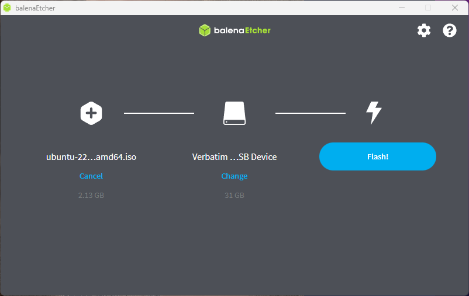
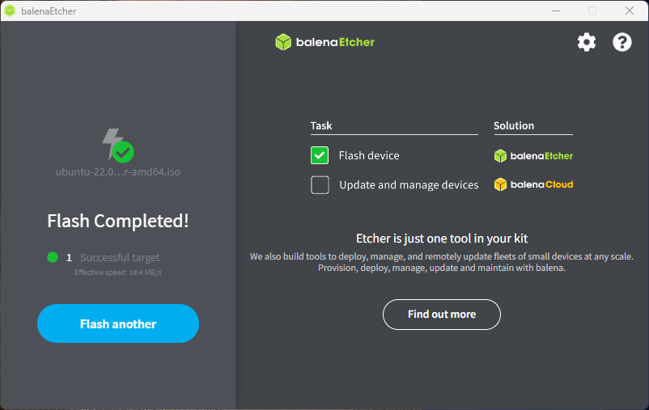
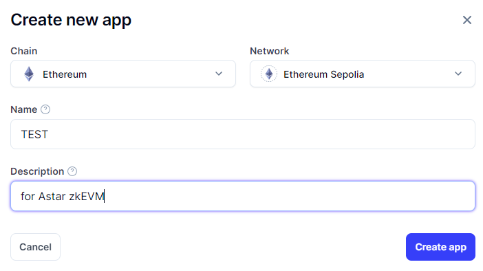
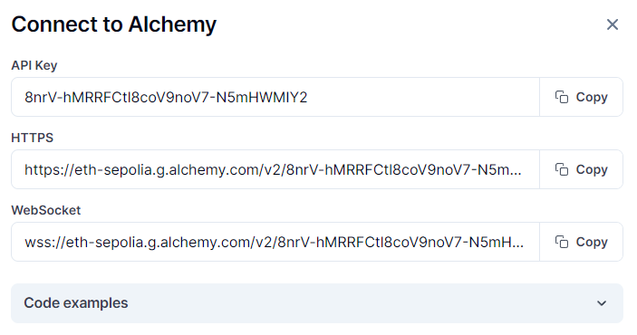

# Building Astar zkEVM Permissionless RPC Node Tutorial

## Overview

This tutorial provides detailed instructions on setting up a Permissionless RPC Node for Astar zkEVM.

This tutorial provides more detailed information based on the following documentation:
[Setup Astar zkEVM Permissionless RPC Node](https://docs.astar.network/docs/build/zkEVM/zk-node/setup-rpc-node/)

**Note:** As of the writing of this tutorial, Astar zkEVM has a deployed testnet, and it is assumed to be operational on the zKatana testnet for the purpose of this guide.

**Note:** The intended audience for this tutorial includes engineers with at least basic knowledge of ICT and proficiency in Linux/Unix shell and fundamental operations.

## Prerequisites

Before setting up Astar zkEVM, several preparations are necessary. This tutorial focuses on running it on a physical PC with x86/64 (Intel, AMD) architecture.

Install a Linux OS (Ubuntu is used here) on this PC and install necessary components like docker and docker-compose to prepare the environment for running containers.

### System 

First, here are the recommended specifications for the PC:

* 16GB RAM
* 4-core CPU
* 100GB Storage (This will increase over time)

Also, the storage space requirements will increase as the network grows.
Ensure that the PC meets these specifications before proceeding with the Astar zkEVM setup.

### Install Ubuntu

The installation of Ubuntu can be referenced from the following documentation.

* https://ubuntu.com/tutorials/create-a-usb-stick-on-windows#1-overview


The general process involves creating a USB installation media for installation on the PC. Subsequently, the USB media is inserted into the PC, and the system is booted to initiate the OS installation. 

Here is a summary of the procedure:

1. Download balenaEtcher.
2. Download the Ubuntu ISO image.
3. Use balenaEtcher to set up the ISO image on a USB drive.


4. Insert the USB drive into the machine where the node will be set up and boot from it.
5. Perform the Ubuntu installation setup.

In this tutorial, we will not delve into the detailed setup of Ubuntu installation. There are no special procedures, and a minimal installation is sufficient.

### Install docker, docker-compose 

The Astar zkEVM RPC node is set to launch as a container. Therefore, preparation of the environment for container startup is necessary. Specifically, ensure that docker and docker-compose are in a usable state.

While docker-compose is part of docker's plugins and should not pose any issues, we will also set up the standalone version. Please refer to the following documentation:

* https://www.docker.com/get-started
* https://docs.docker.com/compose/install/

Below, we provide the setup logs for these, but please consider them as a reference. Make sure to consult the documentation thoroughly for proper preparation.

```bash
$ sudo apt-get update
$ sudo apt -y install build-essential
```
**Install docker**
```bash
$ sudo apt-get -y install ca-certificates curl gnupg
$ sudo install -m 0755 -d /etc/apt/keyrings
$ curl -fsSL https://download.docker.com/linux/ubuntu/gpg | sudo gpg --dearmor -o /etc/apt/keyrings/docker.gpg
$ sudo chmod a+r /etc/apt/keyrings/docker.gpg

$ sudo echo \
  "deb [arch="$(dpkg --print-architecture)" signed-by=/etc/apt/keyrings/docker.gpg] https://download.docker.com/linux/ubuntu \
  "$(. /etc/os-release && echo "$VERSION_CODENAME")" stable" | \
  tee /etc/apt/sources.list.d/docker.list > /dev/null

$ sudo apt-get update
$ sudo apt-get -y install docker-ce docker-ce-cli containerd.io docker-buildx-plugin docker-compose-plugin
```

**Install docker-compose**
```bash
$ DOCKER_CONFIG=${DOCKER_CONFIG:-$HOME/.docker}
$ mkdir -p $DOCKER_CONFIG/cli-plugins
$ curl -SL https://github.com/docker/compose/releases/download/v2.23.0/docker-compose-linux-x86_64 -o $DOCKER_CONFIG/cli-plugins/docker-compose
$ chmod +x $DOCKER_CONFIG/cli-plugins/docker-compose

$ echo "export PATH=$PATH:$DOCKER_CONFIG/cli-plugins/" > ~/.bashrc
$ . ~/.bashrc
$ docker-compose version
Docker Compose version v2.23.0
```

### Preparing Ethereum RPC node
To run the Astar zkEVM RPC node, an Ethereum RPC node is required. [Setup Astar zkEVM Permissionless RPC Node](https://docs.astar.network/docs/build/zkEVM/zk-node/setup-rpc-node/) outlines the process using a public RPC endpoint ('https://eth-sepolia-public.unifra.io'), but in this case, there is a rate limit, which may lead to improper synchronization of the node. Upon actual setup and reviewing the logs, frequent errors were observed.

There are several methods to set up an RPC endpoint. In this tutorial, we will create a test endpoint using **[Alchemy](https://www.alchemy.com/)** and specify it for the Astar zkEVM RPC node. While we won't provide detailed instructions on the creation process, we will include a brief outline of the simple procedure.

1. Create an Alchemy account.
2. From the 'Apps' menu, select 'Create new app' and fill in the required details.

3. Confirm and record the **'API Key'** and **'HTTPS'** of the created app.


**Note:** The information in the image is already invalid, and this is just a sample. 

## Setup zkEVM RPC Node

The Astar zkEVM RPC node will launch the following 5 containers:

* zkevm-rpc (zkevm-node image)
* zkevm-sync (zkevm-node image)
* zkevm-state-db (PostgreSQL image)
* zkevm-pool-db (PostgreSQL image)
* zkevm-prover (zkevm-prover image)

As mentioned earlier, at the time of writing this tutorial, the procedures are based on the assumption of operating on the **zKatana** testnet.

### Setup Container
Create directories for configuration, installation, and data.
Assumes the shell is being run as a regular user.

```bash
$ sudo mkdir -p /etc/zkevm/{install,config} && sudo chown -R $USER:$USER /etc/zkevm
$ sudo mkdir -p /var/lib/zkevm/{statedb,pooldb} && sudo chown -R $USER:$USER /var/lib/zkevm/
```

Set local variables. (Add to .profile or .bashrc, etc.)

```bash
# define installation and config path
ZKEVM_NET=testnet
ZKEVM_DIR=/etc/zkevm/install
ZKEVM_CONFIG_DIR=/etc/zkevm/config
```

Download and extract the **zkatana.tar.gz** (setup file archive).

```bash
$ wget https://shared-assets.astar.network/files/zkevm/zkatana/zkatana.tar.gz
$ tar -xf zkatana.tar.gz -C $ZKEVM_DIR && rm zkatana.tar.gz
```

Copy the env file and edit the L1 RPC URL. Here, specify the value of **'HTTPS'** created in Alchemy.

```bash
$ cp $ZKEVM_DIR/$ZKEVM_NET/example.env $ZKEVM_CONFIG_DIR/.env
$ nano $ZKEVM_CONFIG_DIR/.env
```

```bash
# Use your own Sepolia RPC URL here!!
ZKEVM_NODE_ETHERMAN_URL = "<Insert the value of 'HTTPS' created in Alchemy here.>"
```

Next, edit the node configuration file. Here again, specify the value of **'HTTPS'** created in Alchemy.

```bash
$ nano $ZKEVM_DIR/$ZKEVM_NET/config/environments/$ZKEVM_NET/node.config.toml
```

```bash
[Etherman]
# Set your own Sepolia RPC URL
URL = "<Insert the value of 'HTTPS' created in Alchemy here.>"
```

Start the containers.

```bash
$ sudo docker compose --env-file $ZKEVM_CONFIG_DIR/.env -f $ZKEVM_DIR/$ZKEVM_NET/docker-compose.yml up -d
[+] Building 0.0s (0/0)                                                                                  
[+] Running 6/6
 ✔ Network zkevm             Created            
 ✔ Container zkevm-pool-db   Healthy                                                                                           
 ✔ Container zkevm-state-db Healthy                                                                                            
 ✔ Container zkevm-sync      Started                                                                                            
 ✔ Container zkevm-prover    Started                                                                                            
 ✔ Container zkevm-sync      Started                                                                                            
 ✔ Container zkevm-prover    Started                                                                                            
 ✔ Container zkevm-rpc       Started
```

Verify that all containers are running. The following command is formatted for readability, but simply entering `sudo docker ps` is also acceptable. If the **STATUS** for each container is **Up** then they are running.

```bash
$ sudo docker ps -a --format "table {{.Names}}\t{{.Status}}\t{{.Ports}}"
NAMES            STATUS                    PORTS
zkevm-rpc        Up 17 minutes             0.0.0.0:8545->8545/tcp, :::8545->8545/tcp, 8123/tcp, 0.0.0.0:9091->9091/tcp, :::9091->9091/tcp
zkevm-prover     Up 17 minutes             0.0.0.0:50061->50061/tcp, :::50061->50061/tcp, 0.0.0.0:50071->50071/tcp, :::50071->50071/tcp
zkevm-sync       Up 17 minutes             8123/tcp, 0.0.0.0:9092->9091/tcp, :::9092->9091/tcp
zkevm-state-db   Up 17 minutes (healthy)   0.0.0.0:5432->5432/tcp, :::5432->5432/tcp
zkevm-pool-db    Up 17 minutes (healthy)   0.0.0.0:5433->5432/tcp, :::5433->5432/tcp
```

From this output, you can see that the **zkevm-rpc** container is listening as the Astar zkEVM RPC node. It is operating on port **8545**.

### Test RPC requests

**Test Sample1: Get the chain Id**

```bash
$ curl -H "Content-Type: application/json" -d '{"id":1, "jsonrpc":"2.0", "method": "eth_chainId", "params": []}' http://localhost:8545
```

**Expected response**

```bash
{"jsonrpc":"2.0","id":1,"result":"0x133e40"}
```

If you encounter an error like `curl: (56) Recv failure: Connection reset by peer`,' it's possible that the RPC container is not yet ready. Please wait for a moment and try running it again."


**Test Sample2: Get the latest block**

```bash
$ curl -H "Content-Type: application/json" -d '{"id":1, "jsonrpc":"2.0", "method":"eth_getBlockByNumber", "params":["latest", false]}' http://localhost:8545
```

**Expected response**

```bash
{"jsonrpc":"2.0","id":1,"result":{"parentHash":"0xf4cf938c5cffdd493bf677831f28b114c36b48d5e09834d091c07005c6fe4461","sha3Uncles":"0x1dcc4de8dec75d7aab85b567b6ccd41ad312451b948a7413f0a142fd40d49347","miner":"0xde29a1693c7fbdb0917d2d1b10eecf877e03cc8a","stateRoot":"0x8ae41066e82e21ca1e4b256338ef39fa8ad3e2f6dc55c4bbcb48f9930340b4a1","transactionsRoot":"0xb00ab663744adc2a96b9ab688b1a460477d2b3d2e95a064a978643203bdb5387","receiptsRoot":"0x0a8ac4b7db33b587f6a30bb15fd9ff38eda8eb6fbdc96ad20e8c2cd3ea779abd","logsBloom":"0x00000000000000000000000000000000000000000000000000000000000000000000000000000000000000000000000000000000000000000000000000000000000000000000000000000000000000000000000000000000000000000000000000000000000000000000000000000000000000000000000000000000000000000000000000000000000000000000000000000000000000000000000000000000000000000000000000000000000000000000000000000000000000000000000000000000000000000000000000000000000000000000000000000000000000000000000000000000000000000000000000000000000000000000000000000000","difficulty":"0x0","totalDifficulty":"0x0","size":"0x495","number":"0x25ef","gasLimit":"0x1c9c380","gasUsed":"0x15c4a8","timestamp":"0x6535042b","extraData":"0x","mixHash":"0x0000000000000000000000000000000000000000000000000000000000000000","nonce":"0x0000000000000000","hash":"0xc3425d64a79a51e9407165745f1e0c1671a44bdd57c1fb80cca02d783978e754","transactions":["0xf1fde0ef379af799fd185addadd008ef593997c92d7cbfeec8e1228d61aecbbf"],"uncles":[]}}
```

Upon confirming the expected output for the test as outlined above, you can verify that the RPC node is correctly launched.

## Maintenance/Troublechute

### Stop the containers

```bash
$ sudo docker compose --env-file $ZKEVM_CONFIG_DIR/.env -f $ZKEVM_DIR/$ZKEVM_NET/docker-compose.yml down
[+] Running 6/6
 ✔ Container zkevm-rpc       Removed                                                                                            
 ✔ Container zkevm-prover    Removed                                                                                            
 ✔ Container zkevm-sync      Removed                                                                                            
 ✔ Container zkevm-pool-db   Removed                                                                                            
 ✔ Container zkevm-state-db  Removed                                                                                            
 ✔ Network zkevm             Removed
```


### Check the logs

If it's not starting correctly, encountering errors during a curl check, etc., let's check the logs. The following command views the logs for the **zkevm-rpc** container:


```bash
$ sudo docker logs -fn30 zkevm-rpc
```

## Advanced

### Enable if you want to exploit metrics from nodes

Edit the node configuration file.

```bash
$ nano $ZKEVM_DIR/$ZKEVM_NET/config/environments/$ZKEVM_NET/node.config.toml
```

```bash
[Metrics]
Enabled = true
```
You will need to restart the containers after making configuration changes.

```bash
$ sudo docker compose --env-file $ZKEVM_CONFIG_DIR/.env -f $ZKEVM_DIR/$ZKEVM_NET/docker-compose.yml up -d zkevm-rpc
```


### Enable tracing

To enable tracing features (debug and txpool modules) on the RPC, add the following options( _--http.api=eth,net,debug,zkevm,txpool,web3_ ) to the **zkevm-rpc** container in the docker-compose.yml file:

```
- "/app/zkevm-node run --http.api=eth,net,debug,zkevm,txpool,web3 --network custom --custom-network-file /app/genesis.json --cfg /app/config.toml --components rpc"
```

You will need to restart the containers after making configuration changes.

```bash
$ sudo docker compose --env-file $ZKEVM_CONFIG_DIR/.env -f $ZKEVM_DIR/$ZKEVM_NET/docker-compose.yml up -d zkevm-rpc
```

### Access from outside

To make a RPC endpoint URL available from outside, it is recommended to add a HTTP server. You can refer to this section to install an [nginx server](https://docs.astar.network/docs/build/nodes/archive-node/nginx/).

## References

* [Setup Astar zkEVM Permissionless RPC Node](https://docs.astar.network/docs/build/zkEVM/zk-node/setup-rpc-node/)
* [Create a bootable USB stick with Rufus on Windows](https://ubuntu.com/tutorials/create-a-usb-stick-on-windows#1-overview)
* [balenaEtcher](https://etcher.balena.io/)
* [Ubuntu Downloads](https://ubuntu.com/download/alternative-downloads)
* [Get Started with Docker](https://www.docker.com/get-started)
* [Overview of installing Docker Compose](https://docs.docker.com/compose/install/)
* [Nginx Server](https://docs.astar.network/docs/build/nodes/archive-node/nginx/)


## Author/Contact Information
This guide was written by **tksarah**, Astar ecosystem agent. If you have questions, contact me on [telegram](https://t.me/tksarah0822).

**tksarah:** Astar Network Official Ambassador@Tokyo / web3 Technacal Marketing / IT Infra TechLead / Tech Instructor / School Teacher